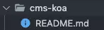
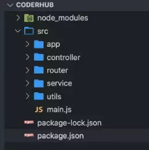
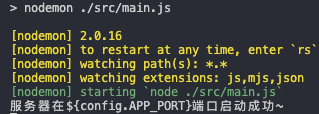

# cms-koa

基于 koa 开发的管理系统


# koa 项目的搭建

在 github 创建一个仓库，将项目克隆下来



初始化 package.json

```javascript
npm init -y
```

安装 koa 库

```javascript
npm install koa
```

安装 nodemon

```javascript
npm install nodemon -D
```

按照功能模块进行划分目录结构：


在app文件夹下创建 index.js，使用 Koa 创建对象，并导出。

```javascript
const Koa = require('koa')

const app = new Koa()

module.exports = app
```

创建 .env 文件，用来管理我们的配置信息，比如：我们填写端口为 8000

```javascript
APP_PORT=8000
```

安装 dotenv 库，并在 app 下创建 config.js 文件

```javascript
npm install dotenv
```

使用 dotenv 库将 .env 文件的配置信息加载到配置文件中：

```javascript
const dotenv = require('dotenv')

dotenv.config()

module.exports = { APP_PORT } = process.env
```

在 main.js 导入 app

```javascript
const app = require('./app')

const config = require('./app/config')

app.listen(config.APP_PORT, () => {
  console.log('服务器在${config.APP_PORT}端口启动成功~')
})

```

在 package.json 配置命令：

```javascript
"start": "nodemon ./src/main.js"
```

执行 npm run start，启动服务器

```javascript
const app = require('./app')

const config = require('./app/config')

app.listen(config.APP_PORT, () => {
  console.log('服务器在${config.APP_PORT}端口启动成功~')
})
```


